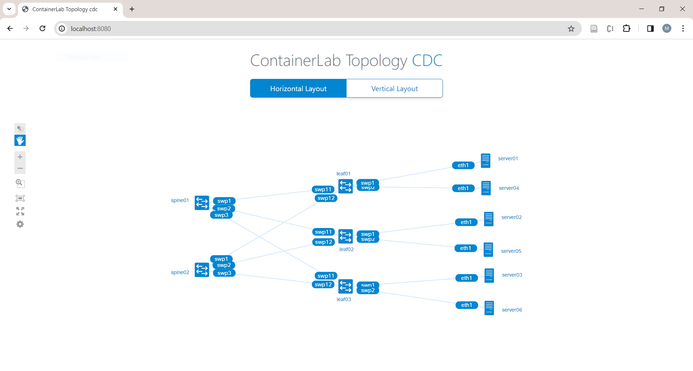
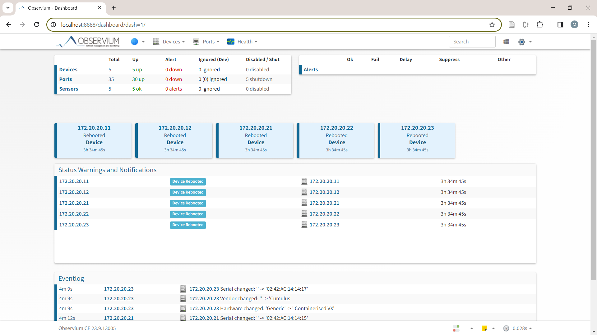
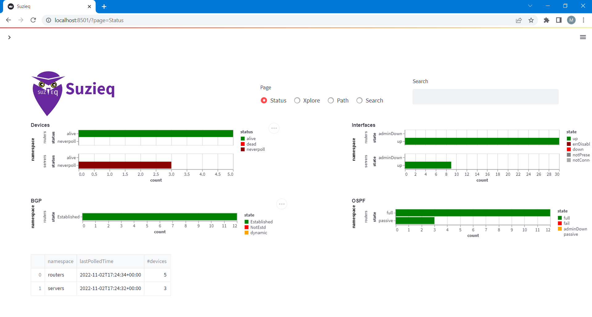
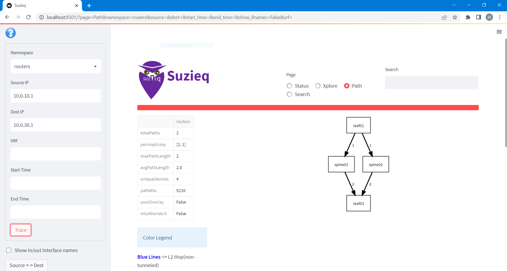

# Spine-Leaf Data Centre Topology using Cumulus routers

[](https://martimy.github.io/clab_cvx_dcn)

This repo includes code and instructions to create a test data centre network using [Cumulus](https://www.nvidia.com/en-us/networking/ethernet-switching/cumulus-linux/) routers. The network is created using [containerlab](https://containerlab.dev/) and it consists of five [VX routers](https://docs.nvidia.com/networking-ethernet-software/cumulus-vx/) connected in a spine-leaf topology (two spine and three leaf). Each leaf router is connected to twp Linux hosts.

Cumulus Linux supports various routing protocols such as BGP, OSPF, and RIP based on the open-source software [FRRouting](https://frrouting.org/). Cumulus routers can be deployed on bare-metal switches or virtual machines, such as Cumulus VX used in this network.



## Applications

1. Routing Configuration: You can use this network environment to learn how to configure various network protocols in the original topology. You may also modify the topology or extend. The initial configuration includes BGP and OSPF routing protocols using numbered interfaces. Cumulus supports unnumbered interface configuration as well.

2. Network Monitoring: You can use this network environment to learn network management and monitoring using SNMP. You can run and configure [Observium](https://www.observium.org/), which is a network monitoring platform, to receive networking performance metrics and events. Also included is [SuzieQ](https://www.stardustsystems.net/suzieq/), an open source software for network observability.

## Requirements

To use this lab, you need to install [containerlab](https://containerlab.srlinux.dev/) (I used the [script method](https://containerlab.srlinux.dev/install/#install-script) Ubuntu 20.04 VM). You also need to have basic familiarity with [Docker](https://www.docker.com/).

Environment:

- Ubuntu 20.04
- Containerlab v0.51.3. Follow these [instructions](https://containerlab.dev/install/) to install.
- Docker v25.03. Follow these [instructions](https://docs.docker.com/engine/install/ubuntu/#install-using-the-convenience-script) to install.

This lab uses the following Docker images form [networkop](https://hub.docker.com/u/networkop):

- networkop/cx:5.3.0
- networkop/host:ifreload
- nicolaka/netshoot:latest
- netenglabs/suzieq:latest (optional)
- martimy/observium:23.9 (optional)
- mariadb:10.6.4 (optional)

These images will be downloaded automatically by containerlab when you deploy the lab topology for the first time.

## Documentation

Find more documentation [here](https://martimy.github.io/clab_cvx_dcn/).

## Cloning the repository

Clone this repository into a folder of your choice:

```
git clone https://github.com/martimy/clab_cvx_dcn dcn
cd dcn
```

## Starting and ending the lab

Use the following command to start the lab:

```
sudo clab deploy -t cvx-dcn.clab.yaml
```

To end the lab:

```
sudo clab destroy -t cvx-dcn.clab.yaml --cleanup
```

## Basic Usage

1. inspect the status of all nodes in the network

    ```
    sudo clab inspect
    ```
    The output should confirm all nodes are running.

    ```
    +---+-------------------+--------------+-------------------------+-------+---------+-----------------+----------------------+
    | # |       Name        | Container ID |          Image          | Kind  |  State  |  IPv4 Address   |     IPv6 Address     |
    +---+-------------------+--------------+-------------------------+-------+---------+-----------------+----------------------+
    | 1 | clab-cdc-leaf01   | ffe6d19c69c5 | networkop/cx:5.3.0      | cvx   | running | 172.20.20.21/24 | 2001:172:20:20::6/64 |
    | 2 | clab-cdc-leaf02   | c74c4810ffd6 | networkop/cx:5.3.0      | cvx   | running | 172.20.20.22/24 | 2001:172:20:20::9/64 |
    | 3 | clab-cdc-leaf03   | c419656cba38 | networkop/cx:5.3.0      | cvx   | running | 172.20.20.23/24 | 2001:172:20:20::8/64 |
    | 4 | clab-cdc-server01 | b2834936ce57 | networkop/host:ifreload | linux | running | 172.20.20.31/24 | 2001:172:20:20::3/64 |
    | 5 | clab-cdc-server02 | 1ccfab86334a | networkop/host:ifreload | linux | running | 172.20.20.32/24 | 2001:172:20:20::2/64 |
    | 6 | clab-cdc-server03 | bd32bbb98b98 | networkop/host:ifreload | linux | running | 172.20.20.33/24 | 2001:172:20:20::5/64 |
    | 7 | clab-cdc-spine01  | d680bac1c120 | networkop/cx:5.3.0      | cvx   | running | 172.20.20.11/24 | 2001:172:20:20::4/64 |
    | 8 | clab-cdc-spine02  | dc897b260ee0 | networkop/cx:5.3.0      | cvx   | running | 172.20.20.12/24 | 2001:172:20:20::7/64 |
    +---+-------------------+--------------+-------------------------+-------+---------+-----------------+----------------------+
    ```


2. Confirm that BGP sessions are established among all peers.

   ```
   docker exec clab-cdc-spine01 vtysh -c "show bgp summary"
   ```

   or using Cumulus commands:

   ```
   docker exec clab-cdc-spine01 net show bgp summary
   ```

   Note: if you encounter the error "Exiting: failed to connect to any daemons.", wait a couple of minutes.

3. Show the routes learned from BGP in the routing table. Notices there are two paths to each host.

   ```
   docker exec clab-cdc-leaf01 vtysh -c "show ip route bgp"
   ```

   or using Cumulus commands:

   ```
   docker exec clab-cdc-spine01 net show bgp
   ```

4. Show all routes

   ```
   docker exec clab-cdc-spine01 net show route
   ```

5. Ping from any one host to another to verify connectivity.

    ```
    docker exec clab-cdc-server01 ping 10.0.30.101
    ```

6. Show the topology

   ```
   clab graph -s "0.0.0.0:8080" -t cvx-dcn.clab.yaml
   ```

   Enter the url 'localhost:8080' in your browser to view the topology. You should see a graph similar to the figure above.


7. Packet sniffing with Wireshark/Tshark

   Bind one container interface to another's so you can run tshark:

   ```
   docker run -it --rm --net container:clab-cdc-spine01 nicolaka/netshoot tshark -i swp1
   ```

   To filter specific protocol, use the -Y option, for example '-Y "snmp"'. To filter based on port, use '-f "udp port 161"'. Please consult the tshark documentaion for more details.
   
    
   You may also need to generate traffic in the network to observe the packets.

9. Router configuration

   You can configure the routers using vtysh:

    ```
   $ docker exec -it clab-cdc-spine01 vtysh

    Hello, this is FRRouting (version 7.5+cl5.3.0u0).
    Copyright 1996-2005 Kunihiro Ishiguro, et al.
    
    spine01# show run
    Building configuration...
    
    Current configuration:
    !
    frr version 7.5+cl5.3.0u0
    frr defaults traditional
    hostname spine01
    service integrated-vtysh-config
    !
    ...
    ```
   
## Alternative Topoloy

There is also an alternative way to include a switch (OVS) connected to each leaf router. Two servers are connected to each switch, making the total of servers in the topology six.

To deploy the clab using this topology, you must create the Open vSwithes first (as per clab rules), then deploy the topology. To end the clab, "destroy" the topology then delete the switches. The following scripts simpify the tasks:

```
$ sudo ./setup-dc.sh
$ sudo clab deploy -t spine-leaf.clab.yaml
```

```
$ sudo clab destroy -t spine-leaf.clab.yaml --cleanup
$ sudo ./reset-dc.sh
```


## Using VLANs

The topology in this lab puts all hosts in one VLAN. You can seperate the hosts into two or more VLANs by adding VLAN IDs to the bridge interface of the leaf routers and changing the host IP addresses accordingly. See [Cumulus documentation](https://docs.nvidia.com/networking-ethernet-software/cumulus-linux-37/Layer-2/Ethernet-Bridging-VLANs/) for details.


## Using Observium

Observium provides real-time information about network health and performance. It uses ICMP, SNMP, and Syslog protocols to automatically discover network devices and services, collect performance metrics, and generate alerts when problems are detected. It supports a wide range of device types, platforms and operating systems, and offers features such as traffic accounting, threshold alerting, and integration with third party applications. Observium has three editions: Community, Professional, and Enterprise. The Community Edition is free and open source,

To able to use Observium, you must enable SNMP on all routers while they are running:

```
~/dcn$  ./enable_snmp.sh
```

The script will start the SNMP daemon in each router and update the configuration file snmpd.conf. The SNMP community string is `snmpcumulus` for SNMP version 1 and 2c. You may also configure SNMPv3 for more security.

```
Configuring SNMP for clab-cdc-spine01...
SNMP configuration completed for clab-cdc-spine01.
...
```


Confirm the ability to connect to a router using SNMP:

```
docker exec clab-cdc-nms snmpwalk -v 2c -c snmpcumulus 172.20.20.11 system
```

This is the partial output:

```
SNMPv2-MIB::sysDescr.0 = STRING: Cumulus-Linux 5.3.0 (Linux Kernel UTC)
SNMPv2-MIB::sysObjectID.0 = OID: SNMPv2-SMI::enterprises.40310
DISMAN-EVENT-MIB::sysUpTimeInstance = Timeticks: (13854) 0:02:18.54
SNMPv2-MIB::sysContact.0 = STRING: root
SNMPv2-MIB::sysName.0 = STRING: spine01
SNMPv2-MIB::sysLocation.0 = STRING: Unknown
SNMPv2-MIB::sysServices.0 = INTEGER: 72
...
```

Change to the Observium directory and create three sub directories (you need to do this only once):

```
~/dcn$ cd observium
~/dcn/observium$ mkdir {data,logs,rrd}
```

Start Observium:

```
~/dcn/observium$ docker compose up -d
```

Open a browser and access Observium via (http://localhost:8888/). Use the username and password found in the `docker-compose.yaml` file. You may change them later.

To add devices to Observium, used the following example:

```
docker compose exec app /opt/observium/add_device.php 172.20.20.11 snmpcumulus v2c
```

Run the discovery and polling scripts for the first time:

```
docker compose exec app /opt/observium/discovery.php -h all
docker compose exec app /opt/observium/poller.php -h all
```

Note: discovery and polling will occur periodically.  



To stop Observium:

```
docker compose down
```

Note: all configuration changes as well as data collected from devices will be persistent even after stopping and removing the containers. The data is saved in the directories you created above.

## Using SuzieQ

SuzieQ is an agentless open-source application that collects, normalizes, and stores timestamped network information from multiple vendors. A network engineer can then use the information to verify the health of the network or identify issues quickly.

SuzieQ is a Python module/application that consists of three parts, a poller, a CLI interface, and a GUI interface. 

<!--
To learn more about SuzieQ, you can refer to these links:

- [Introduction to SuzieQ](https://www.packetcoders.io/introduction-to-suzieq/)
- [SuzieQ Docs](https://suzieq.readthedocs.io/en/latest/)
- [Github repo](https://github.com/netenglabs/suzieq)
- [Whoop Dee Doo for my SuzieQ!](https://gratuitous-arp.net/fabric-like-visibility-to-your-network-with-suzieq/) by Claudia de Luna
-->

SuzieQ is also packaged as a Docker container, which you can use in this lab to get a quick look into its capabilities.

To use SuzieQ, make sure that the clab is running as above, then change directory to suzieq.

```
$cd suzieq
suzieq$ ./start.sh
```

Start the Poller to collect information about the devices in the network:

```
suzieq@b7c0b9263b48:~$ sq-poller -I inventory.yaml -c my-config.yaml &
```

Then and start the GUI:

```
suzieq@b7c0b9263b48:~$ suzieq-gui
```

Direct you browser to "localhost:8501". The [Streamlit](https://streamlit.io/) app gives access to various information that the Poller collected earlier.





More detailed information is available via the CLI. Stop the GUI (CTRL-C) and start the CLI and type the command 'device show' at the prompt:

```
suzieq@b7c0b9263b48:~$ suzieq-cli
suzieq> device show
  namespace  hostname model version   vendor architecture     status       address           bootupTimestamp
0   routers    leaf01    VX   4.3.0  Cumulus       x86_64      alive  172.20.20.21 2022-11-02 12:04:47+00:00
1   routers    leaf02    VX   4.3.0  Cumulus       x86_64      alive  172.20.20.22 2022-11-02 12:04:47+00:00
2   routers    leaf03    VX   4.3.0  Cumulus       x86_64      alive  172.20.20.23 2022-11-02 12:04:47+00:00
3   routers   spine01    VX   4.3.0  Cumulus       x86_64      alive  172.20.20.11 2022-11-02 12:04:47+00:00
4   routers   spine02    VX   4.3.0  Cumulus       x86_64      alive  172.20.20.12 2022-11-02 12:04:47+00:00
5   servers  server01   N/A     N/A      N/A          N/A  neverpoll      server01 1970-01-01 00:00:00+00:00
6   servers  server02   N/A     N/A      N/A          N/A  neverpoll      server02 1970-01-01 00:00:00+00:00
7   servers  server03   N/A     N/A      N/A          N/A  neverpoll      server03 1970-01-01 00:00:00+00:00
...
suzieq> exit
```

Once you finished exploring, you can exit the SuzieQ container. You can also end the clab as above.

## Containerlab Commands Summary

Here is a summary of common containerlab commands:

| Command | Description |
| --- | --- |
| `containerlab deploy -t <file>` | Deploy a lab from a topology file |
| `containerlab destroy -t <file>` | Destroy a lab from a topology file |
| `containerlab inspect -t <file>` | Inspect the lab status and configuration |
| `containerlab graph -t <file>` | Generate a graphical representation of the lab topology |
| `containerlab generate -t <file>` | Generate a CLOS-based lab topology file |
| `containerlab version` | Show the containerlab version and build information |

For more details and examples, you can check out the [containerlab documentation](https://containerlab.dev/cmd/deploy/).

## Acknowledgement

- This lab was originally inspired by the [Cumulus Test Drive lab](https://clabs.netdevops.me/rs/cvx03/) created by Michael Kashin.
- Sources of some Docker images:
   - https://github.com/networkop/cx
   - https://github.com/somsakc/docker-observium
   - https://github.com/nicolaka/netshoot
