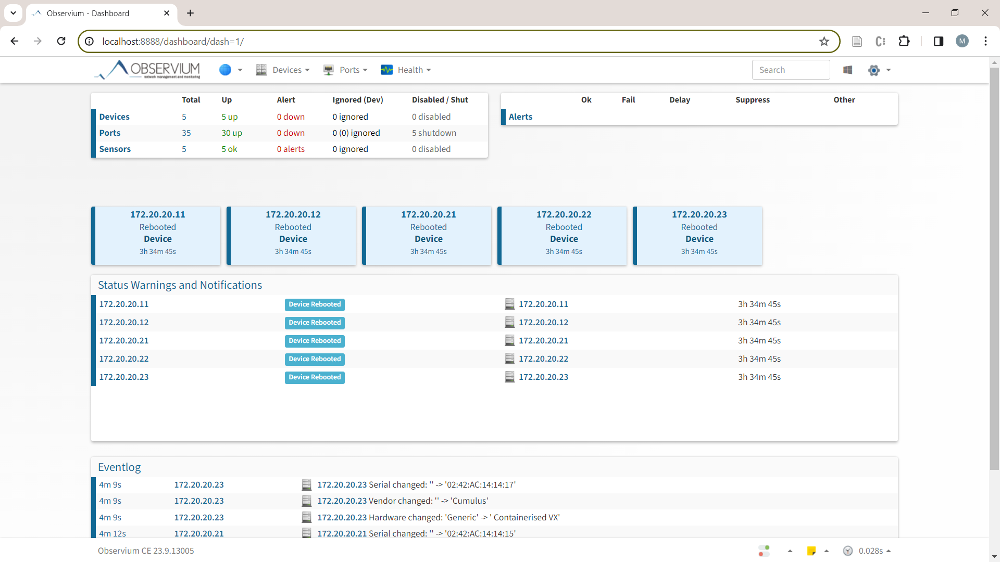

# Observium

Observium provides real-time information about network health and performance. It uses ICMP, SNMP, and Syslog protocols to automatically discover network devices and services, collect performance metrics, and generate alerts when problems are detected. It supports a wide range of device types, platforms and operating systems, and offers features such as traffic accounting, threshold alerting, and integration with third party applications. Observium has three editions: Community, Professional, and Enterprise. The Community Edition is free and open source,

To able to use Observium, you must enable SNMP on all routers after the topology is deployed:

```
~/dcn$  ./enable_snmp.sh
```

The script will start the SNMP daemon in each router and update the configuration file snmpd.conf. The SNMP community string is `snmpcumulus` for SNMP version 1 and 2c. You may also configure SNMPv3 for more security.

```
Configuring SNMP for clab-cdc-spine01...
SNMP configuration completed for clab-cdc-spine01.
...
```


Confirm the ability to connect to a router using SNMP:

```
docker exec clab-cdc-nms snmpwalk -v 2c -c snmpcumulus 172.20.20.11 system
```

This is the partial output:

```
SNMPv2-MIB::sysDescr.0 = STRING: Cumulus-Linux 5.3.0 (Linux Kernel UTC)
SNMPv2-MIB::sysObjectID.0 = OID: SNMPv2-SMI::enterprises.40310
DISMAN-EVENT-MIB::sysUpTimeInstance = Timeticks: (13854) 0:02:18.54
SNMPv2-MIB::sysContact.0 = STRING: root
SNMPv2-MIB::sysName.0 = STRING: spine01
SNMPv2-MIB::sysLocation.0 = STRING: Unknown
SNMPv2-MIB::sysServices.0 = INTEGER: 72
...
```

Change to the Observium directory and create three sub directories (you need to do this only once):

```
~/dcn$ cd observium
~/dcn/observium$ mkdir {data,logs,rrd}
```

Start Observium:

```
~/dcn/observium$ docker compose up -d
```

Open a browser and access Observium via (http://localhost:8888/). Use the username and password found in the `docker-compose.yaml` file. You may change them later.

To add devices to Observium, used the following example:

```
docker compose exec app /opt/observium/add_device.php 172.20.20.11 snmpcumulus v2c
```

Run the discovery and polling scripts for the first time:

```
docker compose exec app /opt/observium/discovery.php -h all
docker compose exec app /opt/observium/poller.php -h all
```

Note: discovery and polling will occur periodically.



To stop Observium:

```
docker compose down
```

Note: all configuration changes as well as data collected from devices will be persistent even after stopping and removing the containers. The data is saved in the directories you created above.
