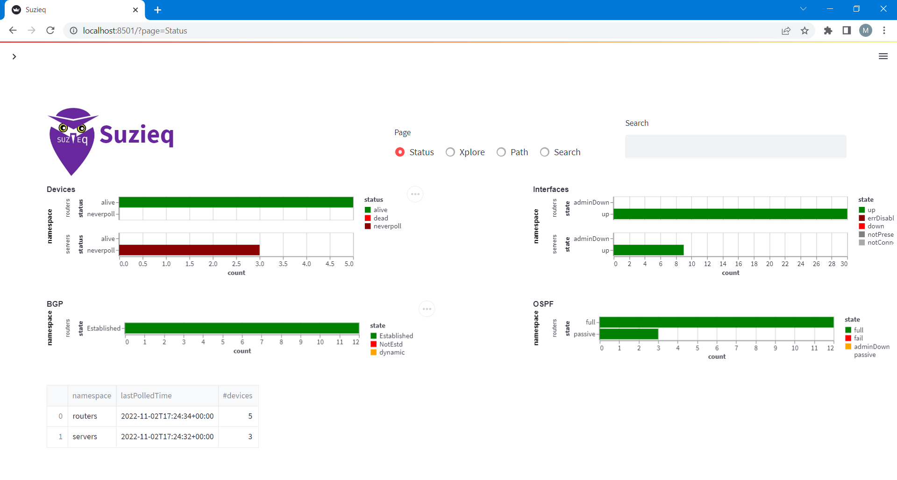
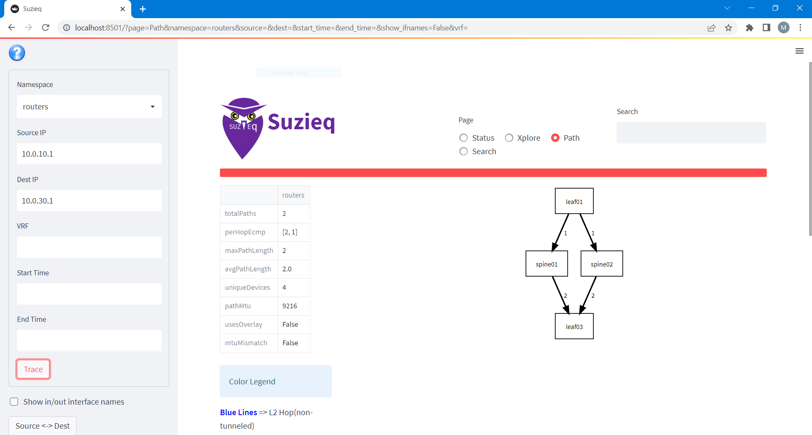

# SuzieQ

SuzieQ is an agentless open-source application that collects, normalizes, and stores timestamped network information from multiple vendors. A network engineer can then use the information to verify the health of the network or identify issues quickly.

SuzieQ is a Python module/application that consists of three parts, a poller, a CLI interface, and a GUI interface.

SuzieQ is also packaged as a Docker container, which you can use in this lab to get a quick look into its capabilities.

To use SuzieQ, make sure that the clab is running as above, then change directory to suzieq.

```
$cd suzieq
suzieq$ ./start.sh
```

Start the Poller to collect information about the devices in the network:

```
suzieq@b7c0b9263b48:~$ sq-poller -I inventory.yaml -c my-config.yaml &
```

Then and start the GUI:

```
suzieq@b7c0b9263b48:~$ suzieq-gui
```

Direct you browser to "localhost:8501". The [Streamlit](https://streamlit.io/) app gives access to various information that the Poller collected earlier.





More detailed information is available via the CLI. Stop the GUI (CTRL-C) and start the CLI and type the command 'device show' at the prompt:

```
suzieq@b7c0b9263b48:~$ suzieq-cli
suzieq> device show
  namespace  hostname model version   vendor architecture     status       address           bootupTimestamp
0   routers    leaf01    VX   4.3.0  Cumulus       x86_64      alive  172.20.20.21 2022-11-02 12:04:47+00:00
1   routers    leaf02    VX   4.3.0  Cumulus       x86_64      alive  172.20.20.22 2022-11-02 12:04:47+00:00
2   routers    leaf03    VX   4.3.0  Cumulus       x86_64      alive  172.20.20.23 2022-11-02 12:04:47+00:00
3   routers   spine01    VX   4.3.0  Cumulus       x86_64      alive  172.20.20.11 2022-11-02 12:04:47+00:00
4   routers   spine02    VX   4.3.0  Cumulus       x86_64      alive  172.20.20.12 2022-11-02 12:04:47+00:00
5   servers  server01   N/A     N/A      N/A          N/A  neverpoll      server01 1970-01-01 00:00:00+00:00
6   servers  server02   N/A     N/A      N/A          N/A  neverpoll      server02 1970-01-01 00:00:00+00:00
7   servers  server03   N/A     N/A      N/A          N/A  neverpoll      server03 1970-01-01 00:00:00+00:00
...
suzieq> exit
```

Once you finished exploring, you can exit the SuzieQ container.

To learn more about SuzieQ, you can refer to these links:

- [Introduction to SuzieQ](https://www.packetcoders.io/introduction-to-suzieq/)
- [SuzieQ Docs](https://suzieq.readthedocs.io/en/latest/)
- [Github repo](https://github.com/netenglabs/suzieq)
- [Whoop Dee Doo for my SuzieQ!](https://gratuitous-arp.net/fabric-like-visibility-to-your-network-with-suzieq/) by Claudia de Luna
